This article is a follow up to [Custom Alerts Using Prometheus Queries, Part One](https://rancher.com/blog/2020/custom-monitoring). In this chapter we will have the same demo of installing Prometheus and configuring AlertManager to send emails when alerts are fired, but in a much simpler way, using Rancher all the way through.

We will see how easy it is to accomplish this without the need of having all the dependencies used in previous article. We won't need:
- dedicated box configured to run kubectl pointing to Kubernetes cluster
- knowledge using `kubectl` as we can do everything using Rancher's UI
- helm binary installed/configured 

## Prerequisites for the Demo

- A Google Cloud Platform account (the free tier provided is more than enough). Any other cloud should work the same.
- Rancher v2.4.2 (latest version at time of publication).
- A Kubernetes cluster running on Google Kubernetes Engine version 1.15.11-gke.3. (Running EKS or AKS should be the same).

### Starting a Rancher Instance

To begin, start your Rancher instance. There is a very intuitive getting started [guide](https://rancher.com/quick-start/) for Rancher that you can follow for this purpose.

### Using Rancher to Deploy a GKE cluster

Use Rancher to set up and configure a Kubernetes cluster. Documentation can be found [here](https://rancher.com/docs/rancher/v2.x/en/cluster-provisioning/)

### Deploying Prometheus Software

To install Prometheus software, we will take advantage of Rancher's catalog. The catalog is a collection of Helm charts that make it easy to repeatedly deploy applications.

As soon as our cluster is up and running, let's select the **Default** project created for it and in Apps tab and click the Launch button.

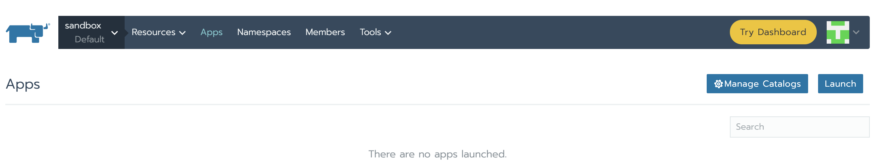

Let's search here within all these charts the one we're interested in. We have here a bunch of fields, for this demo we will just leave the default values. Lots of useful information about these can be found in the Detailed Descriptions section. Feel free to take a look to understand what they are used for. Now, to the bottom of the page let's click Launch, Prometheus Server and Alertmanager will be installed and configured.

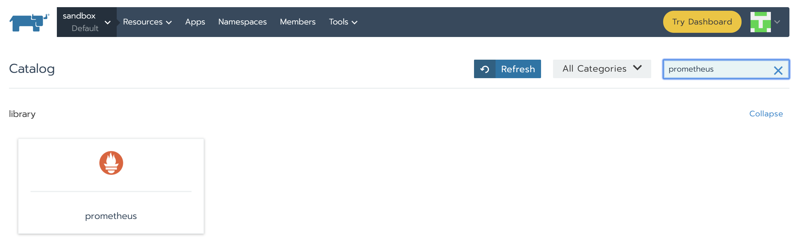

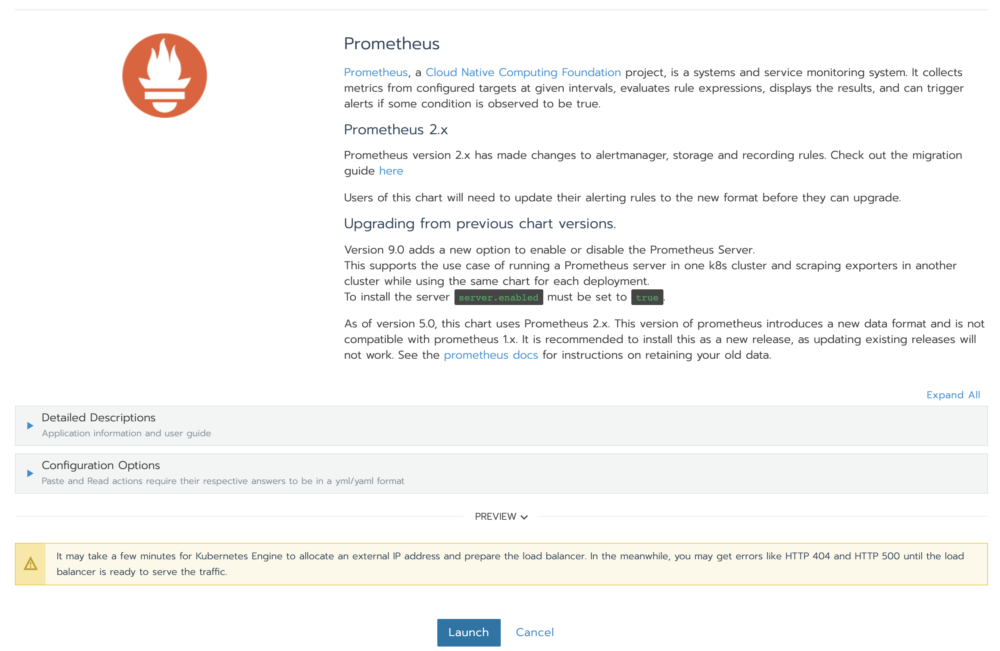

When installation is finished it should look like this:

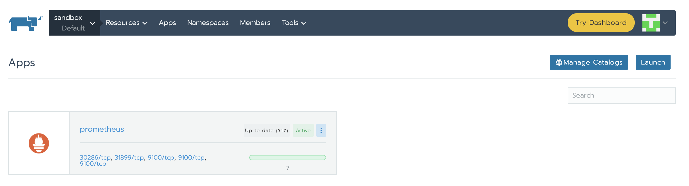

In order to access Prometheus Server and Alertmananger we need to create [Services](https://kubernetes.io/docs/concepts/services-networking/service/). We can see under Resources - Workloads tab, Load Balancing section that there is no configuration of this kind yet. Click on Import YAML, make sure you select prometheus namespace, paste the two YAMLs one at a time and click Import. You will understand later how we knew to use those specific ports and components tags.

```yaml
apiVersion: v1 
kind: Service 
metadata: 
  name: prometheus-service 
spec: 
  type: LoadBalancer
  ports: 
  - port: 80
    targetPort: 9090
    protocol: TCP
  selector: 
    component: server
```
```yaml
apiVersion: v1 
kind: Service 
metadata: 
  name: alertmanager-service 
spec: 
  type: LoadBalancer
  ports: 
  - port: 80
    targetPort: 9093
    protocol: TCP
  selector: 
    component: alertmanager
```
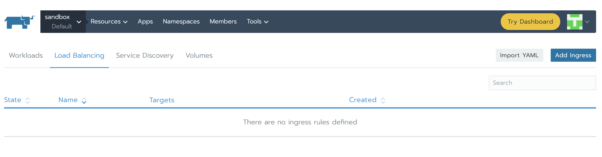
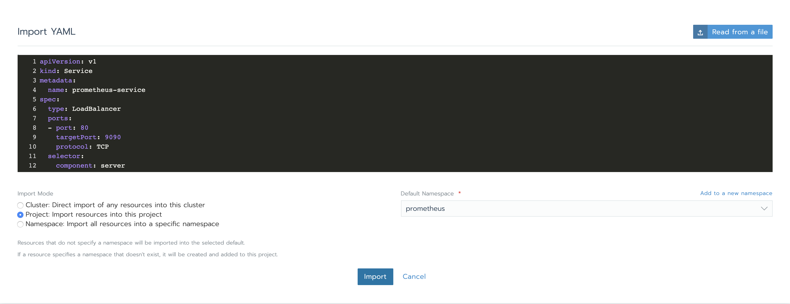

When finished, services will be showing as Active.

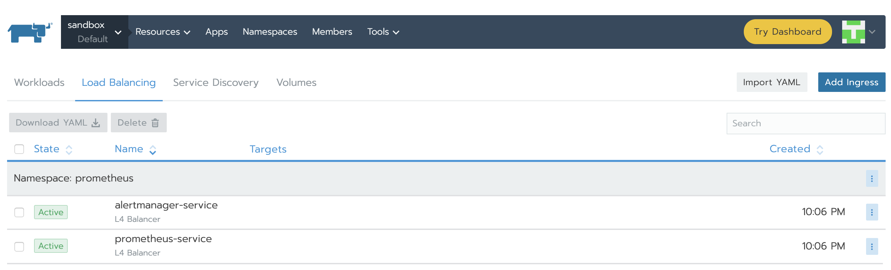

The IPs can be found from the vertical ellipsis (3 vertical dots) menu button and clicking the View/Edit YAML. At the bottom of the yaml file it will be a section similar to this:
 
 ```yaml
 status:
  loadBalancer:
    ingress:
    - ip: 34.76.22.14
 ```
 
Accessing the IPs will show us the GUI for both, Prometheus Server and Alertmanager. Explore them a bit, still there is not much to see at this point as there are no rules defined and there is no alerting configuration.

### Rules

Rules enable us to trigger alerts. These rules are based on Prometheus expression language expressions. Whenever a condition is met, the alert is fired and sent to Alertmanager.

Let's see how we can add rules.

In Resources -> Workload tab we can see what Deployments have been created while running the chart. We are interested in `prometheus-server` and `prometheus-alertmanager`.

Let's start with the first one and understand its configuration, how we can edit it and what port is the service running on. Let’s do this by clicking the vertical ellipsis (3 vertical dots) menu button and clicking the View/Edit YAML item.

First thing we can see, the two containers associated to this Deployment, `prometheus-server-configmap-reload` and `prometheus-server`. The section dedicated to `prometheus-server` container has some relevant information:

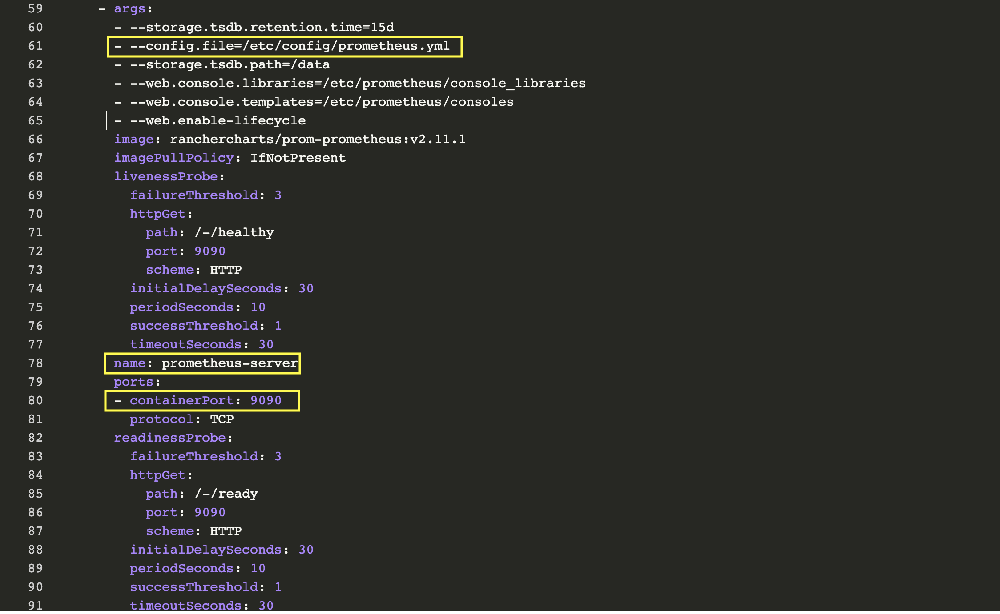

As we can see Prometheus is configured through [prometheus.yml](https://prometheus.io/docs/alerting/configuration/). This file (and any others listed in serverFiles) will be mounted into the server pod. In order to add/edit rules we will need to modify this file. This is in fact a Config Map, which can be found in Resources Config Tab. Click the vertical ellipsis (3 vertical dots) menu button and Edit. In the rules section let's add a few rules and click save.

```yaml
groups:
    - name: memory demo alert
      rules:
      - alert: High Pod Memory
        expr: container_memory_usage_bytes{pod_name=~"nginx-.*", image!="", container!="POD"} > 5000000
        for: 1m
        labels:
          severity: critical
        annotations:
          summary: High Memory Usage

    - name: cpu demo alert
      rules:
      - alert: High Pod CPU
        expr: rate (container_cpu_usage_seconds_total{pod_name=~"nginx-.*", image!="", container!="POD"}[5m]) > 0.04
        for: 1m
        labels:
          severity: critical
        annotations:
          summary: High CPU Usage
```

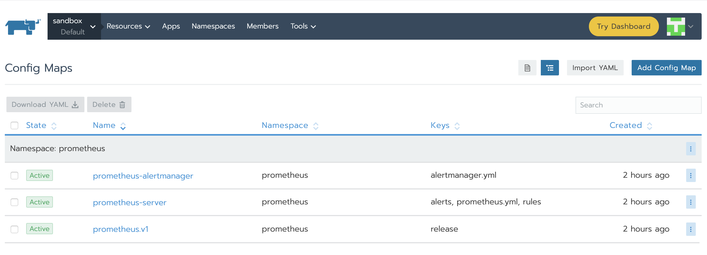
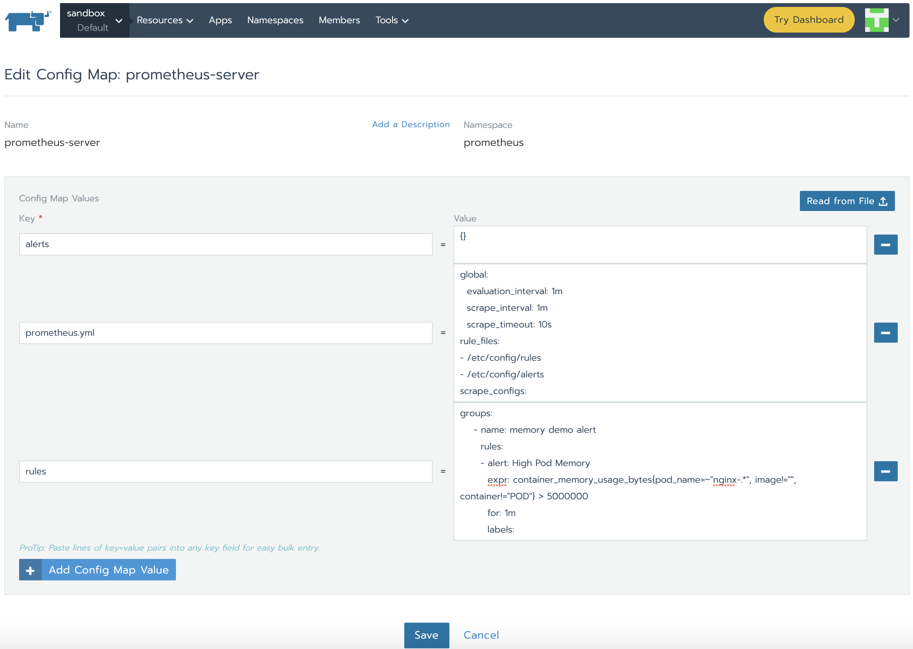

The rules are automatically loaded by Prometheus Server and we can see them right away in Prometheus server GUI:

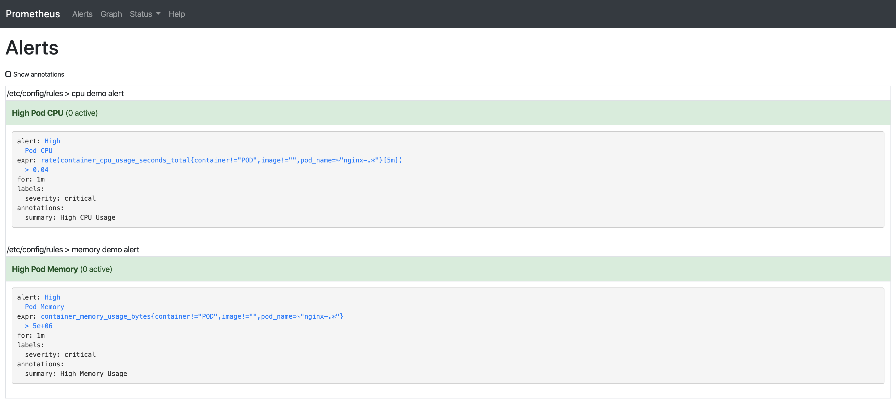

Few words about the two used rules in the above example:
- container_memory_usage_bytes: current memory usage in bytes, including all memory regardless of when it was accessed
- container_cpu_usage_seconds_total: cumulative cpu time consumed in seconds.

All the metrics can be found [here](https://github.com/google/cadvisor/blob/master/metrics/prometheus.go).

All regular expressions in Prometheus use [RE2 syntax](https://github.com/google/re2/wiki/Syntax). Using regular expressions, we can select time series only for pods whose name match a certain pattern. In our case, we look for pods that start with `nginx-` and exclude "POD" as this is the parent [cgroup](https://kubernetes.io/docs/setup/production-environment/container-runtimes/#cgroup-drivers) for the container and will show stats for all containers inside the pod.
 
For container_cpu_usage_seconds_total, we use what it is called a `Subquery`. This returns the 5-minute rate of our metric.
 
More info about queries and some examples can be found on the official Prometheus documentation [page](https://prometheus.io/docs/prometheus/latest/querying/basics/).

### Alerts

Alerts can notify us as soon as a problem occurs, letting us know immediately when something goes wrong with our system. Prometheus covers this aspect providing alerting via its Alertmanager component.

We can follow the same steps as for Prometheus Server. Under Resources Workload tabs, going to prometheus-alertmanager View/Edit YAML under vertical ellipsis (3 vertical dots) menu button we can check its configuration.

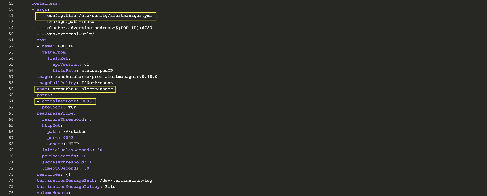

AlertManager is configured through [alertmanager.yml](https://prometheus.io/docs/prometheus/latest/configuration/configuration/). This file (and any others listed in alertmanagerFiles) will be mounted into the alertmanager pod. In order to set up alerting we need to modify the configMap associated to alertmanager. Under Resources Config tag, on prometheus-alertmanager line click the vertical ellipsis and then Edit. Replace the basic configuration with the following one:

```yaml
global:
  resolve_timeout: 5m
route:
  group_by: [Alertname]
  # Send all notifications to me.
  receiver: demo-alert
  group_wait: 30s
  group_interval: 5m
  repeat_interval: 12h
  routes:
  - match:
      alertname: DemoAlertName
    receiver: 'demo-alert'

receivers:
- name: demo-alert
  email_configs:
  - to: your_email@gmail.com
    from: from_email@gmail.com
    # Your smtp server address
    smarthost: smtp.gmail.com:587
    auth_username: from_email@gmail.com
    auth_identity: from_email@gmail.com
    auth_password: 16letter_generated token # you can use gmail account password, but better create a dedicated token for this    
    headers:
      From: from_email@gmail.com
      Subject: 'Demo ALERT'
```

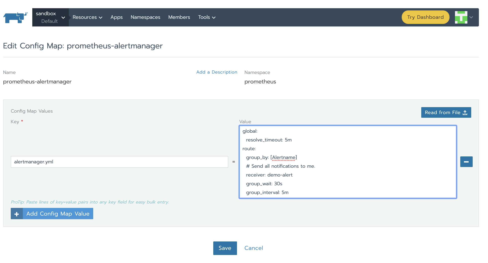

The new configuration is automatically reloaded by alertmanager and we can see it right away in the GUI under Status tab.

### Testing end-to-end scenario

Let’s deploy something to monitor. A simple nginx deployment should be enough for this exercise. Using Rancher GUI, under Resources Workloads Tab click Import YAML, paste the code below (use the default namespace this time) and hit Import.

```yaml
apiVersion: apps/v1 # for versions before 1.9.0 use apps/v1beta2
kind: Deployment
metadata:
  name: nginx-deployment
spec:
  selector:
    matchLabels:
      app: nginx
  replicas: 3 # tells deployment to run 2 pods matching the template
  template:
    metadata:
      labels:
        app: nginx
    spec:
      containers:
      - name: nginx
        image: nginx:1.7.9
        ports:
        - containerPort: 80
```

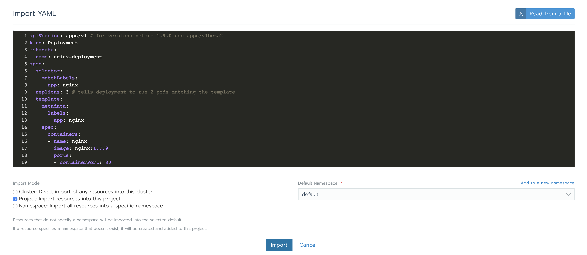

In the Prometheus UI, using one of the two expression we configured for alerts we can see some metrics:

```
rate (container_cpu_usage_seconds_total{pod_name=~"nginx-.*", image!="", container!="POD"}[5m])
```

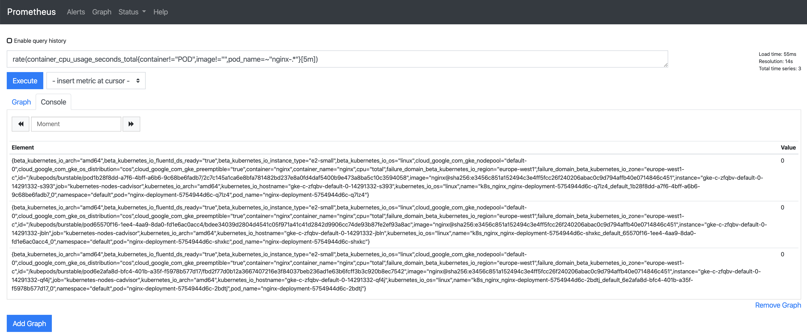

Let’s put some load in one of the Pods to see the value change. When the value is greater than 0.04, we should have an alert. For this we need to select one of the nginx Deployment Pods and click Execute Shell. Inside it we will execute a command:

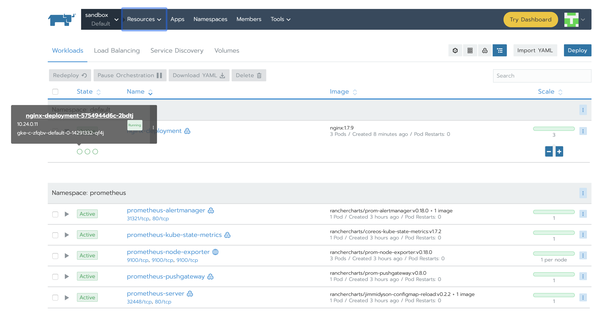
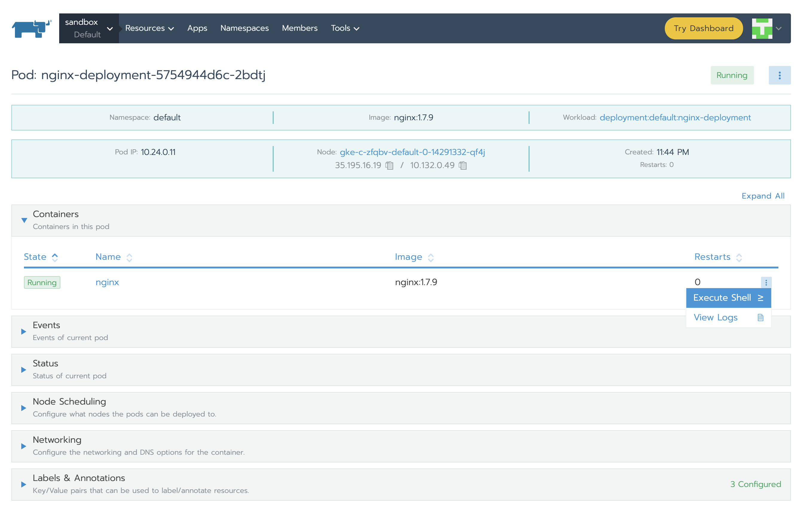
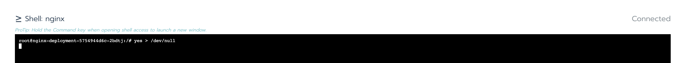

The alert has three phases:

- Inactive - condition is not met.
- Pending - condition is met.
- Firing - alert is fired.

We already saw the alert in inactive state, so putting some load on the CPU will let us observe the rest of them, too:

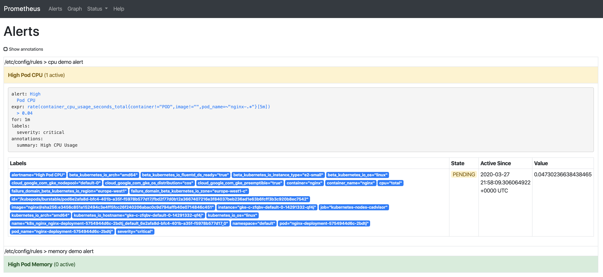
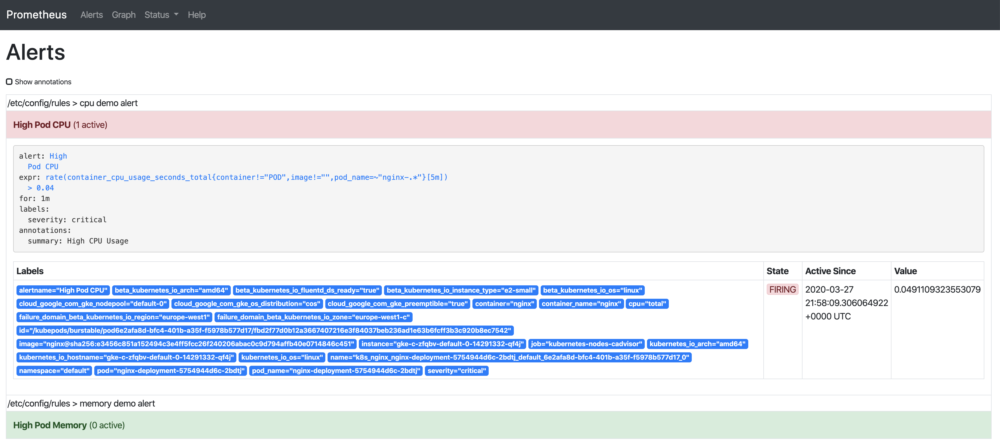

As soon as the alert is fired, this will be present in Alertmanager:

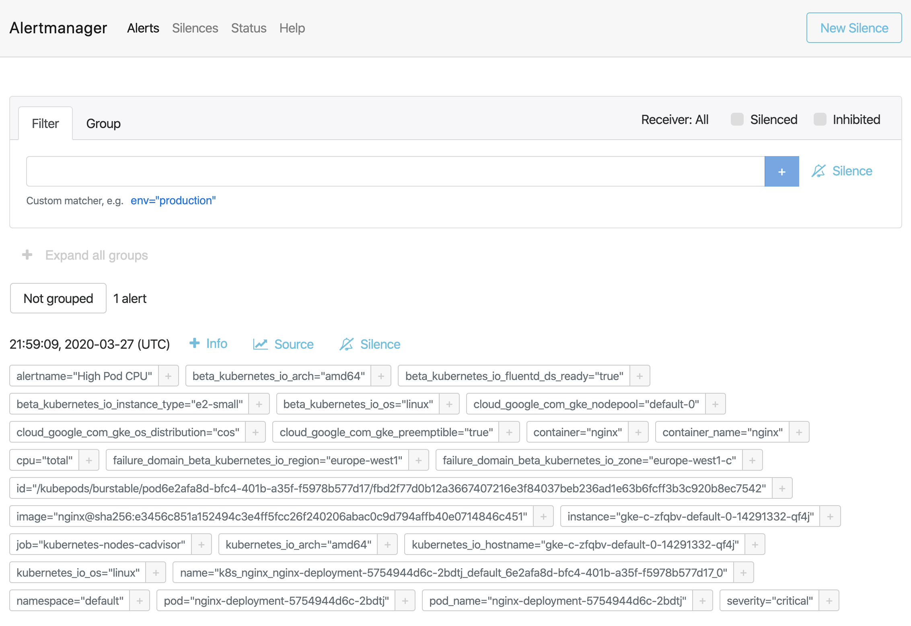

Alertmanager is configured to send emails when we receive alerts. If we check the inbox, we’ll see something like this:

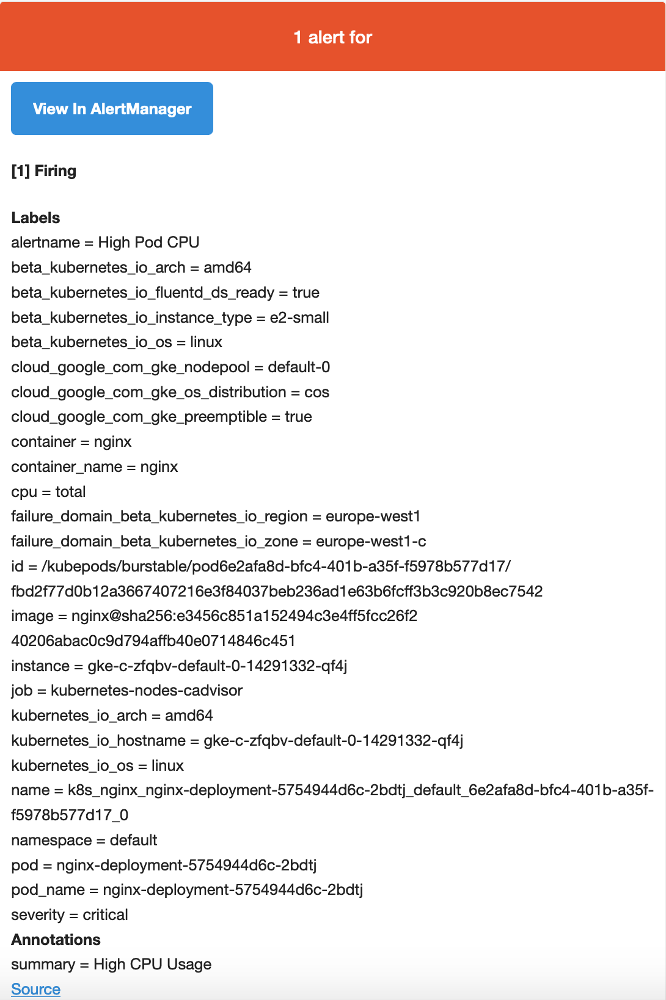

### Conclusion

We know how important monitoring is, but it would not be complete without alerting. Alerts can notify us as soon as a problem occurs, letting us know immediately when something goes wrong with our system. Prometheus covers both of these aspects -- monitoring the solution and alerting via its Alertmanager component. We saw how easy is to use Rancher in order to deploy Prometheus and have Prometheus Server integrated with alertmanager. Also using Rancher we configured alerting rules and pushed a configuration for alertmanager so it can notify us when something happens. We saw how based on the definition/integration of AlertManager we received an email with details of the triggered alert (this can also be sent via Slack or PagerDuty).
